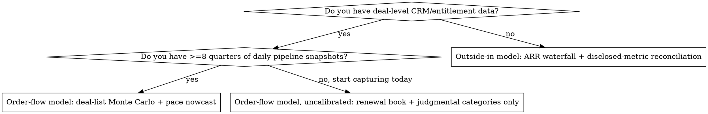

# Data Protection Revenue Forecasting

## Overview

Forecasting a backup/data-protection vendor is not a growth-rate extrapolation. It is a
**four-stage identity chain** plus **an explicit statement of what you do not know**:

```
demand signal → pipeline → BOOKINGS (ACV/ARR, TCV) → BILLINGS → REVENUE (ASC 606) → CASH
```

Almost every large forecast error in this category comes from one of two things: silently
mixing two links of that chain, or reporting a point estimate for a quantity that is genuinely
a distribution. This skill exists to prevent both.

**Core principle:** the recurring base is highly predictable and the incremental layer is not.
Separate them, forecast them differently, and report the split. A vendor with $1.1B of ARR and
$300M of at-risk new business does not have "one" forecast uncertainty — it has almost none on
83% of next year's revenue and a lot on the rest.

## The Iron Rules

1. **Never sum across measure types.** ACV, ARR, TCV, billings, revenue, and cash are five
   different quantities. `TCV = ACV × term_years`, so a shift from 1-year to 3-year terms
   triples reported TCV bookings with zero change in ARR. Tag every stored number with its
   measure type and refuse to aggregate mismatched types.
2. **Never output a point estimate alone.** Every forecast ships with quantiles, the method
   used to produce them, and the score you will grade yourself with. A number without an
   interval is an opinion.
3. **Baseline first, story second.** Write down the autocorrelation-implied growth *before*
   reading any driver research, and timestamp it. Then let drivers move it, and record the
   size of the move.
4. **Cite or label.** Every input is either sourced (URL + period) or explicitly tagged
   `[ASSUMPTION]`. There is no third category.
5. **ARR growth is not revenue growth.** For FY27 Commvault guides subscription ARR +18.5%
   against total revenue +10.2%; Rubrik's FY26 was revenue +48.5% against subscription ARR
   +33.8%. The wedge is accounting, and its sign flips depending on where the vendor sits in
   its recognition transition.

## Choose the approach



Both branches converge on the same last three steps: bookings → ASC 606 revenue bridge →
driver-based P&L → scored probabilistic output. The order-flow branch replaces a *distributional
prior* on new business with a *deal-level simulation* of it; nothing else changes.

## Procedure

1. **Fix definitions.** Read the vendor's own ARR/NRR definitions before using them.
   Commvault's Total ARR includes support attached to *perpetual* licenses; Rubrik's
   Subscription ARR excludes perpetual maintenance. They are not comparable.
   Check `references/company-profiles.md` for recasts that break the time series.
2. **Split the revenue base** into contracted (deferred revenue + RPO run-off) and at-risk
   (renewals in the period, expansion, new logos, consumption overage). Compute the
   **visibility ratio** = contracted / total forecast. This bounds your achievable accuracy.
3. **Establish the baseline** by fitting growth autocorrelation on the vendor's own 8–12
   quarters, shrunk toward the public comparables. Record it before reading anything else.
4. **Enumerate variables** from `references/variable-taxonomy.md`. Mark each as known,
   estimable, or unknown. Do not silently drop the unknowns.
5. **Model new business.** With order flow → `references/with-order-flow.md`. Without →
   `references/without-order-flow.md`.
6. **Apply exogenous drivers as bounded deviations**, grouped into mutually exclusive
   mechanism buckets so ransomware, cyber insurance and regulation are not triple-counted.
   See `references/demand-drivers-and-alt-data.md`.
7. **Bridge bookings to revenue** under ASC 606, per contract, on a schedule — never as a
   growth rate applied to last quarter's revenue.
8. **Reconcile to disclosed metrics**: RPO roll-forward, cRPO, deferred revenue, billings.
   A residual above ~2–3% of RPO means the bookings mapping is wrong.
9. **Build the P&L by stream**, not from a blended gross margin. See
   `references/profit-levers.md`.
10. **Simulate**, don't point-estimate. Use `engine/dpforecast.py`.
11. **Score and calibrate** against a named benchmark. See
    `references/probability-and-calibration.md`.
12. **Rank the levers** for the "what moves the needle" question, with the arithmetic shown.

## The output contract

A forecast deliverable from this skill has these parts, in this order:

1. **Headline**: median and the 80% interval for each forecast quantity, with units and period.
2. **The split**: contracted vs at-risk revenue, and the visibility ratio.
3. **Decomposition**: opening ARR → renewals → expansion → churn → new logos → closing ARR;
   then ARR → revenue under the recognition rules.
4. **The three to five variables the answer is most sensitive to**, each with its assumed
   range and the effect on the headline of moving it across that range.
5. **Assumption register**: every `[ASSUMPTION]` input, its value, and what would falsify it.
6. **Scoring plan**: the benchmark you are beating, the proper score you will use (CRPS or
   pinball), and when the forecast resolves.

## Quick reference — what actually moves the needle

Ranked for a ~$1.2B-revenue vendor at ~81% gross margin and ~72% opex ratio. Full arithmetic
in `references/profit-levers.md`.

| Lever | Realistic 1-yr move | Revenue | Operating margin | Confidence |
|---|---|---|---|---|
| Opex growth vs revenue growth gap | 0–10 pts | none | **+0.60 pt per pt of gap** | High (identity) |
| Price / renewal uplift | +1 to +3 pts | +1.0 to +3.0% | +0.95 to +2.85 pts | High on math |
| Channel discount discipline | 1 pt off a 30% discount | +1.43% | +1.36 pts | Medium |
| Payment terms → multi-year prepaid | 10% of ARR | **zero** | one-time FCF ≈ +$240M | High on math |
| SaaS gross margin | +3 to +10 pts | none | +0.8 to +2.8 pts | Medium-High |
| Cross-sell instead of new logo | shift $50M net-new ARR | none | +2.7 pts (S&M saved) | Medium |
| NRR ±5 pts | 117%↔127% | yr-1 ±0.85% | 3-yr ARR ±$179M | Medium-High |
| Term-license → SaaS mix | +10 pts of mix | reported growth **−8.5 pts** | gross margin −3.3 pts | High |
| GRR ±2 pts | 88%↔92% | yr-1 ∓1% | **terminal value +11%/−9%** | Medium |
| FX | ±3 pts | disclosed, material | partial natural hedge | High |

Two lessons hide in that table. Most "growth" levers are slow-fuse valuation levers with small
first-year P&L effects, while the fastest levers (opex gap, price, discount, payment terms)
are operating decisions with no demand content at all. And the largest single mover of
*reported* revenue growth — the term-license-to-SaaS mix shift — changes no economics whatsoever.

## The engine

`engine/dpforecast.py` is dependency-light (numpy only; it uses scipy for the normal CDF when
present and falls back to a built-in approximation when not) and runnable:

```bash
cd .agents/skills/data-protection-revenue-forecasting/engine
python3 dpforecast.py               # API summary
python3 test_dpforecast.py          # self-test suite, all must pass
python3 example_outside_in.py       # full worked Commvault FY27 forecast, end to end
```

| Area | Functions |
|---|---|
| Measure-type safety | `Quantity` (refuses to add ACV to TCV), `tcv_from_acv` |
| Baseline | `fit_ar1` with peer shrinkage, `ar1_paths`, `visibility_ratio` |
| Order flow | `simulate_deal_list` (one-factor Gaussian copula), `fit_rho_to_target_sd`, `category_forecast`, `pace_nowcast` |
| Correlation algebra | `bvn_cdf`, `indicator_correlation`, `latent_rho_from_indicator`, `effective_deal_count`, `exchangeable_sd_inflation` |
| Input calibration | `platt_fit`/`platt_apply`, `isotonic_fit`/`isotonic_apply` (PAVA), `shrink_binomial`, `shrink_normal` |
| ARR | `simulate_arr_waterfall` with within-year correlation |
| ASC 606 | `Contract`, `recognize_contracts` → revenue by kind, billings, RPO, cRPO, deferred revenue, contract assets |
| Reconciliation | `revenue_identity_residual`, `rpo_rollforward_residual` |
| P&L and cash | `pnl_by_stream`, `fcf_bridge` (with the SBC/buyback trap made explicit) |
| Closed-form levers | `price_lever`, `discount_lever`, `prepaid_cash_lever`, `operating_margin_from_growth_gap`, `magic_number`, `cac_payback_months`, `arr_half_life`, `steady_state_arr`, `required_pipeline_coverage` |
| Scoring | `crps_ensemble`, `crps_normal`, `pinball_loss`, `brier_score`, `log_score_ensemble`, `pit_values`, `interval_coverage`, `pit_uniformity_chisq`, `skill_score`, `quantile_sum_error` |
| Sensitivity | `rank_levers` |

**Read the worked example before writing your own.** It forecasts Commvault FY27 revenue from
public filings only and lands on a conclusion worth internalizing: the entire disagreement
with management's guidance reduces to one *accounting* variable, the ARR-to-revenue conversion
factor, and not to any view about demand. Management's revenue guide and its own ARR guide are
only mutually consistent if that factor drops 4.2 points in a year. Finding out that your
disagreement is about revenue recognition rather than about the business is the normal outcome
in this category, and the example shows the arithmetic that surfaces it.

## Common mistakes

| Mistake | Why it breaks | Fix |
|---|---|---|
| Blended gross margin | 33-pt spread between term license (97.6%) and SaaS (64.5%) | Model COGS per stream |
| Independent Bernoulli deal simulation | Understates variance badly; a common macro shock hits many deals at once | One-factor Gaussian copula, ρ estimated from historical over-dispersion |
| Feeding a latent copula ρ into the Bernoulli over-dispersion formula | Latent ρ ≠ indicator ρ: 0.20 becomes 0.119 at p=0.30 | `latent_rho_from_indicator`, or bisect on the simulation |
| Sizing a correlation adjustment off the raw deal count | Heavy-tailed deal sizes mean 68 deals can behave like 23 | Use `effective_deal_count` = (Σa)²/Σa² |
| Sum-of-quantiles aggregation | P90 of a total ≠ sum of segment P90s | Aggregate the simulation draws, then take quantiles |
| Data growth × price = TAM | Dedup, tiering and price deflation break the link; IDC's own DataSphere is data *created*, not stored | Use data growth as a qualitative floor only |
| Treating stated intent as demand | 76% negative on Broadcom, but only 4% fully migrated after two years | Discount survey intent by the observed conversion rate |
| Extrapolating reported growth through a recast | Commvault's FY27 subscription base jumped +$202M by definition change alone | Rebase to the recast series first |
| Non-GAAP operating margin read as cash | Excludes SBC that costs real cash via buybacks | Build the FCF bridge explicitly |
| Using CRM stage probabilities as-is | They are policy defaults, not estimates | Recalibrate on resolved deals (Platt or isotonic) |

## Red flags — stop and redo

- You produced a single number for a quarter or a year.
- Your driver adjustments moved baseline growth by more than about a third of the baseline.
- Every driver on your list points the same direction.
- You compared two vendors' ARR without checking both definitions.
- You cannot say which of contracted or at-risk revenue your uncertainty is coming from.
- You have no benchmark to score against, so "the forecast was roughly right."

## References

| File | Contents |
|---|---|
| `references/variable-taxonomy.md` | Every forecast variable, its measure type, source, and where it enters |
| `references/with-order-flow.md` | CRM/channel/entitlement schemas, pipeline conversion, judgmental calibration, deal-list Monte Carlo, ASC 606 bridge, nowcasting, failure modes |
| `references/without-order-flow.md` | Outside-in procedure from public disclosure only, with the reconciliation checks |
| `references/probability-and-calibration.md` | Measuring predictability, producing calibrated distributions, proper scoring, backtesting, judgmental debiasing |
| `references/demand-drivers-and-alt-data.md` | Market sizing, named catalysts with proxy series, alt-data with honest predictive value, driver-to-forecast translation |
| `references/profit-levers.md` | Margin structure, unit economics formulas, the ranked sensitivity table, driver-based P&L and FCF bridge |
| `references/company-profiles.md` | Sourced financials, definitions, guidance history, seasonality, and comparability traps per vendor |
| `engine/dpforecast.py` | The runnable engine (see table above) |
| `engine/example_outside_in.py` | Worked Commvault FY27 forecast producing the full output contract |
| `engine/test_dpforecast.py` | Self-tests; every numeric claim checked against a closed form or a recovery experiment |
